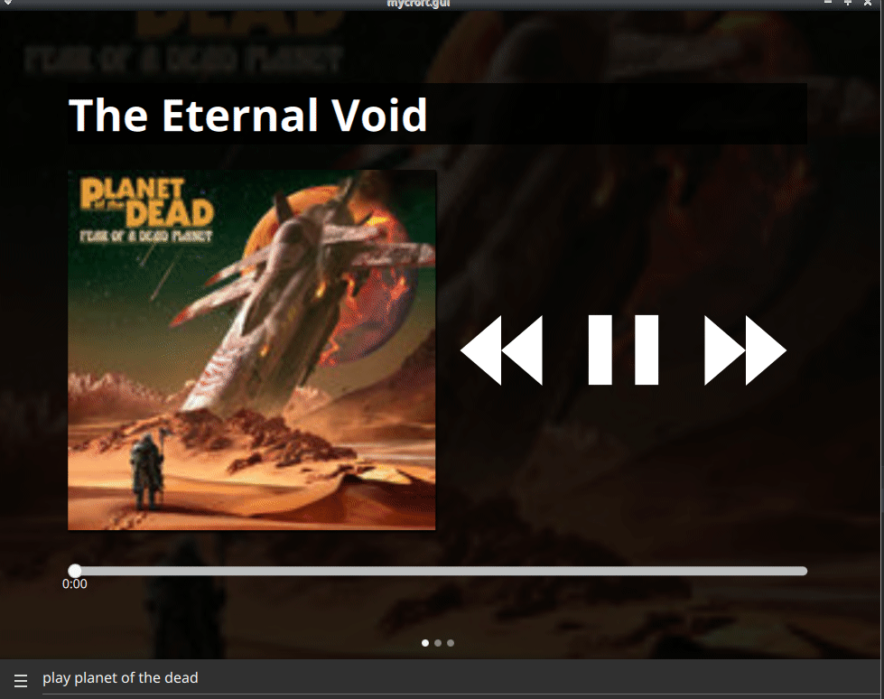

#  BandCamp Skill

## About

Bandcamp skill for your hipster music needs



## Examples
* "play compressorhead"
* "play astronaut problems"
* "play {artist/album/genre/track}"

* "search bandcamp for black metal"
* "search bandcamp for {artist/album/genre/track}"

* "play center of all infinity album"
* "play {album} album"

* "play freezing moon by mayhem"
* "play {track} by {artist}"

## Settings

you can add queries to skill settings that will then be pre-fetched on skill load

this populates the featured_media entries + provides fast matching against cached entries

```javascript
{    
"featured_tracks" : ["astronaut problems"],
"featured_artists":  ["compressorhead"],
"featured_sets": ["jazz", "classic rock"]
}
```

a local cache of entries can be found at `~/.cache/OCP/Bandcamp.json`


## Credits
JarbasAl

## Category
**Entertainment**

## Tags
- music
- audio
- bandcamp
- common play

